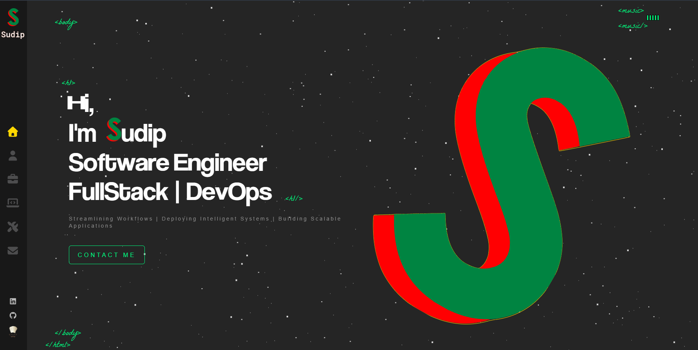
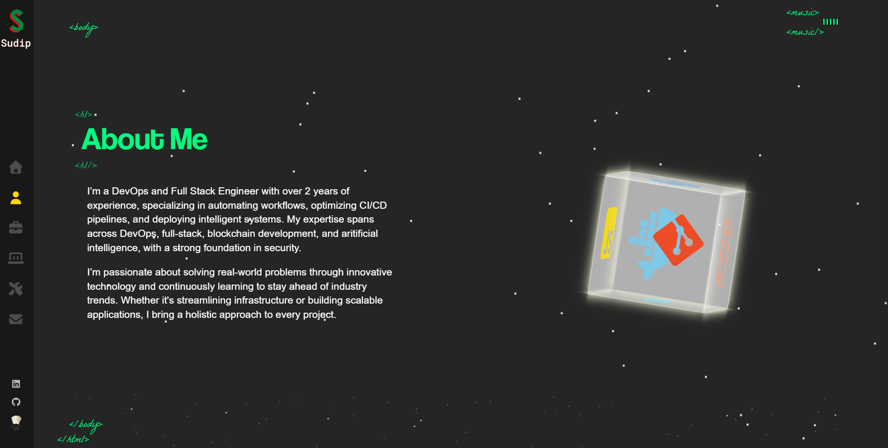
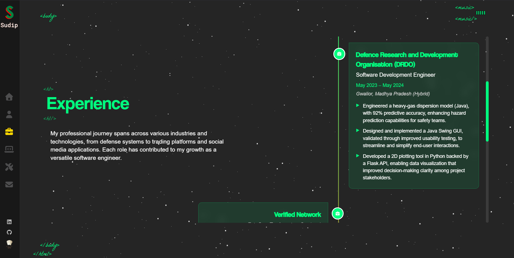
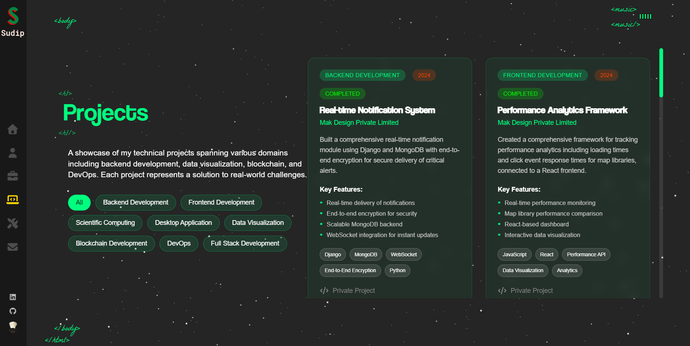
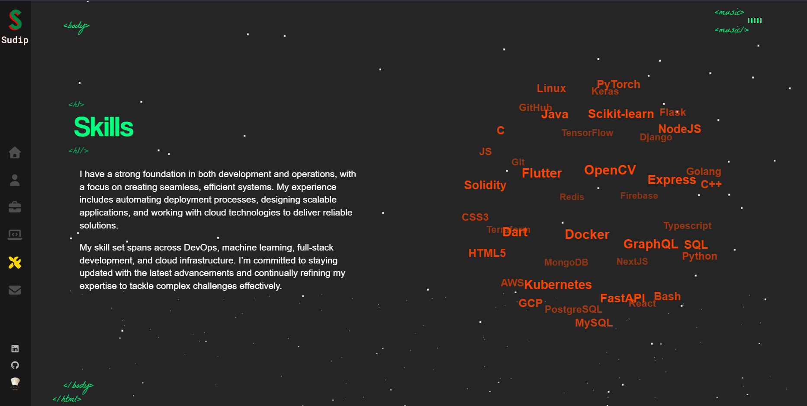
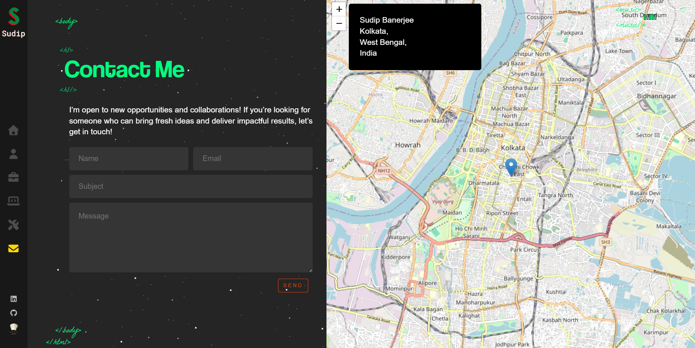

# 🚀 Personal Portfolio

A modern, interactive portfolio website showcasing my journey as a Software Development Engineer. Built with React and featuring smooth animations, responsive design, and a sleek dark theme.

## 🌐 Live 
**[Visit Portfolio](https://portfolio-metaloopa.vercel.app)**

## ✨ Features
- **Interactive UI** with smooth animations and transitions
- **Responsive Design** optimized for all devices
- **Multiple Sections**: Home, About, Experience, Projects, Skills, Contact
- **Modern Glassmorphism** design with blur effects
- **3D Flip Cards** for project showcases
- **Timeline Layout** for work experience
- **Sound Integration** with ambient background music

## 🛠️ Tech Stack
- **Frontend**: React, SCSS, FontAwesome
- **Animations**: CSS3 Transforms, Keyframes
- **Deployment**: Vercel
- **Design**: Glassmorphism, Dark Theme

## 📸 Screenshots

### Home Page


### About Me


### Work Experience


### Projects Showcase


### Skills & Technologies


### Contact Information


## 🚀 Quick Start

```bash
# Clone the repository
git clone https://github.com/metal-oopa/personal-portfolio.git

# Navigate to project directory
cd personal-portfolio

# Install dependencies
npm install

# Start development server
npm start
```

---
